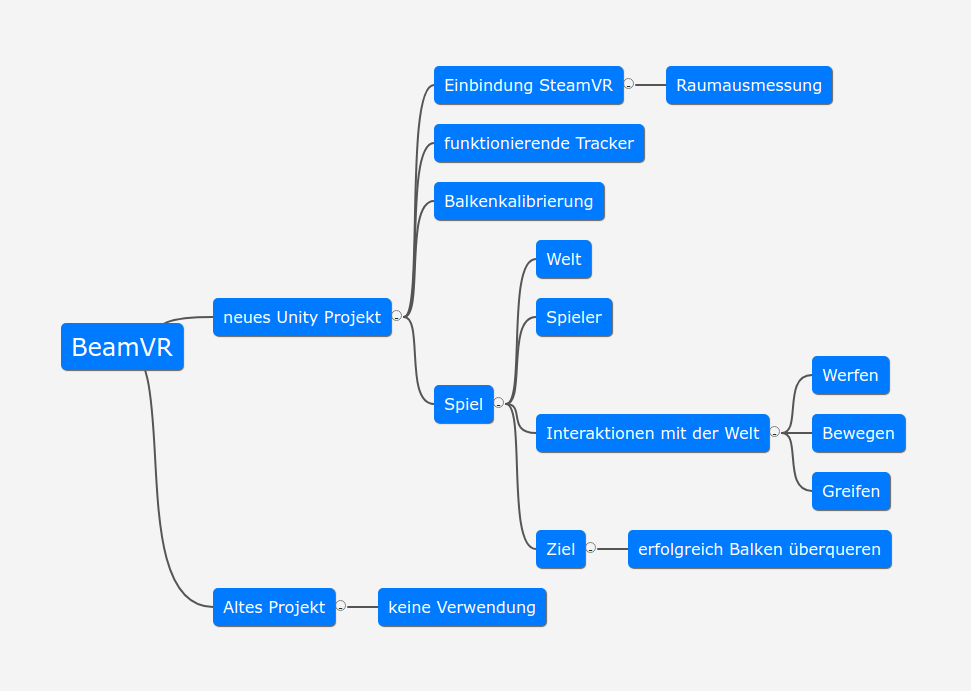

# BeamVR
## Projektantrag
### Ausgangslage
#### Ist-Situation
Als Basisspiel steht uns ein Unityprojekt des Vorgängerjahrgangs zur verfügung. In diesem ist der Gedanke, reale Gegenstände (in diesem Fall einen Balken) in die virtuelle Welt zu bringen. Die Umgebung bildet eine Stadt ab, in der man auf dem Dach eines Hochhauses über den virtuellen Balken balancieren soll. Bei einem Fehltritt fällt man hinab und das Spiel endet.

Als technisches Equipment stehen uns hierbei zwei Basisstationen, drei Body-Tracker (zwei für die Füße, einen für die Hüfte) und zwei Controller, welche virtuell die Hände zeigen, zur verfügung.

#### Probleme
Beim alten BeamVR-Spiel treten mehrere Fehler auf. Die Kalibrierung des Spielers in die virtuelle Welt geschieht oft nicht ordnungsgemäß, da die Körperteile in der virtuellen Welt versetzt von der realen Welt sind. Dadurch kann sich der Spieler nicht orientieren und sich nicht richtig bewegen. Zusätzlich wird der Hüfttracker nicht kalibriert, weshalb sich die Hüfte des Spielers in der virtuellen Welt nicht bewegt und sich das Model des Spielers verzerrt.
Weiteres befindet sich der Balken in der virtuellen Welt nicht auf der richtigen Position, wodurch sich der Spieler am Balken in der realen Welt nicht orientieren kann und sich dadurch verletzen könnte.

### Zielsetzung
Da beim vorjährigen BeamVR, wie zuvor erwähnt einige Schwierigkeiten auftreten und wir viele neue Ideen haben, wollen wir eine neue, eigene Version, dennoch mit dem selben Hintergedanken, reale Gegenstände in die virtuelle Welt zu bringen, programmieren.

Hierbei ist die Idee, als virtuelle Welt einen Dschungel zu verwenden. Wir wollen mit Gegenständen, wie Lianen arbeiten, mit denen man interagieren und diese zur Seite schieben kann um sich weiterzubewegen. Es soll auch möglich sein, mit anderen virtuellen Gegenständen, wie beispielsweise Steinen zu interagieren und diese zu werfen.

Das Ziel des Spiels soll sein, dass man ohne vom Balken zu fallen alle Hindernisse überwinden kann.

Wenn man vom Balken fällt, ist das Spiel verloren und das Spiel beginnt wieder am Anfang des Balkens.

#### Konzept zur Problemlösung

### Projektrisiken
- Hardwarediebstahl
- Hardwarebeschädigung / zerstörung
- bei zu spätem Arbeiten in der Schule eingesperrt werden

### Planung
#### Grobe Meilensteine
- Balken in die VR-Welt bringen
- Alles wird korrekt getrackt
- schöne Spielwelt
- weitere Funktionen

## User Stories (mit Hintergedanken Tag der offenen Tür)
1. Als Projektteam wollen wir eine einfache Kalibrierung, damit wir keine Zeit verlieren und möglichst viele angehende Schüler:innen unser Spiel testen können.

2. Als Proejktteam wollen wir den Balken in jeder beliebigen Umgebung schnell und einfach in die virtuelle Welt bringen. Das Ausmessen soll mit den Controllern erfolgen. 

3. Als Spieler will ich die richtigen Maße des Balkens der realen Welt sehen. Somit sollen etwaige Unfälle vermieden werden.

4. Als Spieler will ich in der virtuellen Welt vom Balken fallen können und erkenntlich sehen, dass ich das Spiel verloren habe.

5. Als Spieler will ich mit Gegenständen (wie Steine oder Lianen des Dschungels) interagieren können, beispielsweise bewegen oder werfen.

6. Als Spieler möchte ich einen menschlichen Körper sehen wenn ich nach unten schaue. Dies sollten eine Hüfte, zwei Beine, zwei Arme und zwei Hände sein.